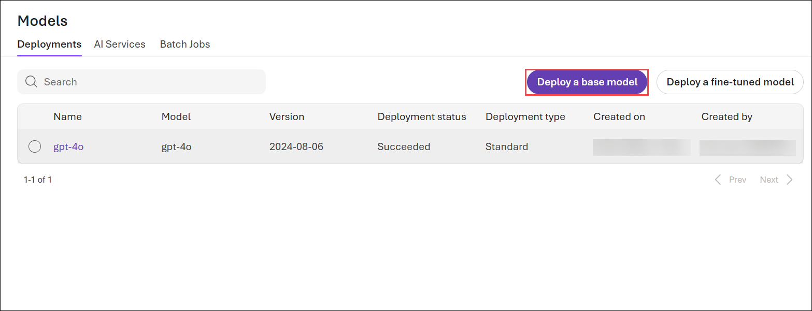
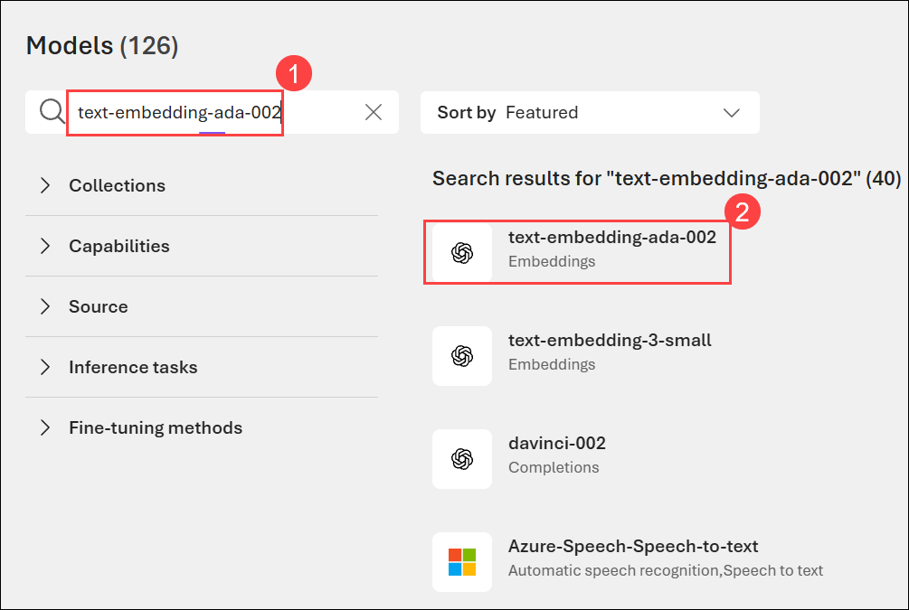
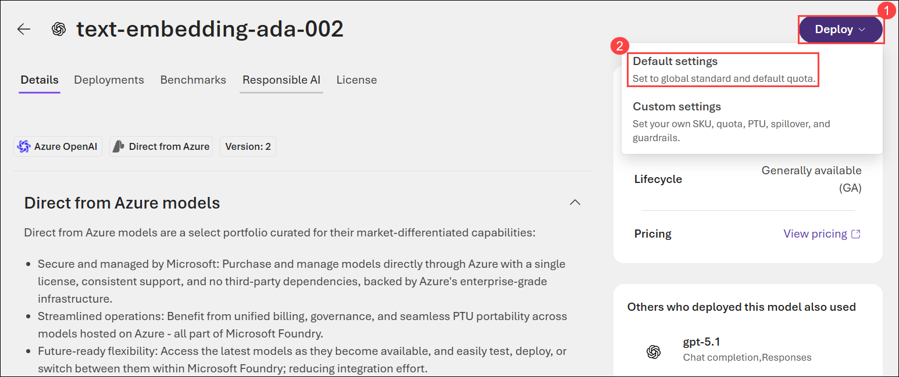
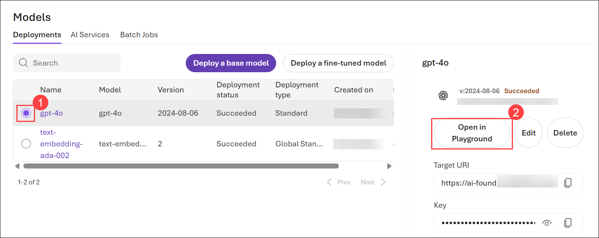
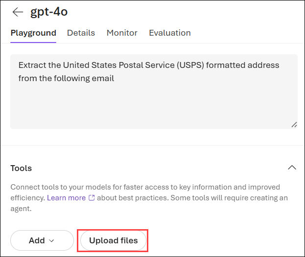
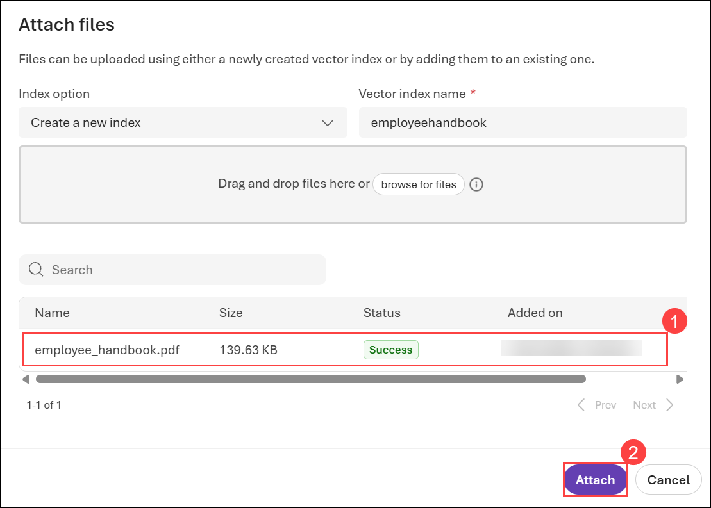

# Exercise 5: Retrieval-Augmented Generation (RAG)

### Estimated Duration: 40 Minutes

## Overview

In this exercise, you will explore the Retrieval Augmented Generation (RAG) pattern, an AI architecture that enhances response quality by integrating relevant external knowledge into the generative process. Designed for those new to RAG, the lab guides you through how retrieval mechanisms work alongside generative models to deliver more accurate, informed, and context aware outputs. 

## Objectives

In this exercise, you will complete the following tasks:

- Task 1: Deploy a Text Embedding model

- Task 2: Create Azure AI Search

- Task 3: Create a Semantic Search Plugin to query the AI Search Index

## Task 1: Deploy a Text Embedding model

In this task, you will explore different flow types in Microsoft Foundry by deploying a Text Embedding model to enable text representation and similarity analysis.

1. In your browser window in Lab VM, navigate to the **Microsoft Foundry** portal.

1. Click **Deploy base model**.

    

1. Search for **text-embedding-ada-002 (1)**, select **text-embedding-ada-002 (2)** model..

    

1. Click on **Deploy (1)** drop-down and select **Default settings (2)** to deploy the model.

    

1. Navigate back to **Models** pages, select **gpt-4o (1)**, and click on **Open in playground (2)**.

    

1. In the **Playground**  tab of **gpt-4o** model, under **Tools** click on **Upload files**.

    

1. In the **Attach files**, provide the following details:

    - Vector index name: Enter **employeehandbook (1)**

    - Click on **Browse for files (2)**
  
1. Navigate to `C:\LabFiles\ai-developer\Dotnet\src\BlazorAI\data\` and select **employee_handbook.pdf (1).** Click on **Open (2)**.

    

1. Once you file is **Uploaded (1)** **Attach (2)** to upload the files.

      

1. The data injection might take around **5** Minutes.

    

1. In the **Azure portal**, search for **AI Search (1)** using the top search bar and select **AI Search (2)** from the Services list.

    

1. Select the **ai-search-<inject key="Deployment ID" enableCopy="false"></inject>** search service.
    
    

1. On the **Overview (1)** page, copy the **URL (2)** and paste it into Notepad.

    

1. From the left navigation pane, expand **Settings (1)**, click on **Keys (2)**, copy the **Primary admin key (3)** and paste it into Notepad.

    

  > **Congratulations** on completing the lab! Now, it's time to validate it. Here are the steps:
  > - Hit the Validate button for the corresponding task. If you receive a success message, you can proceed to the next  task. 
  > - If not, carefully read the error message and retry the step, following the instructions in the lab guide.
  > - If you need any assistance, please contact us at cloudlabs-support@spektrasystems.com. We are available 24/7 to help

<validation step="aba3f1c2-bf55-4ca3-baf6-fcaa280552fa" />

## Task 2: Create Azure AI Search

In this task ,you will create an Azure AI Search resource.

1. On the Azure portal search bar, search for **AI Search (1)** and select **AI Search (2)** from the results.

    

1. From the left navigation pane, ensure **AI Search (1)** is selected and then click on **+ Create (2)** from the top menu bar.

    

1. On the **Create a search service** page, provide the following details and then click on **Review+create (6)**:

    - **Subscription:** Leave the default one **(1)**

    - **Resource group:** Select **ai-foundry-<inject key="Deployment ID" enableCopy="false"></inject> (2)**

    - **Service name:** Enter **ai-search-<inject key="Deployment ID" enableCopy="false"></inject> (3)**

    - **Region:** Select **<inject key="Region" enableCopy="false"></inject> (4)** 

    - Pricing tier: Select **Standard (5)**

        >**Note:** In case you do not see the Standard tier, it means that the region selected does not have the Standard tier available right now. Please select another region and deploy the resource.

      

1. Click **Create** to deploy the search service.

    

## Task 3: Create a Semantic Search Plugin to query the AI Search Index

In this task, you will explore different flow types in Microsoft Foundry by creating a Semantic Search Plugin to query the AI Search Index for enhanced retrieval capabilities.

<details>
<summary><strong>Python</strong></summary>

1. Open **Visual Studio Code** in the **Lab VM**.

1. Navigate to `Python > src` directory and open **.env** file.

    

1. Paste the **AI search URL** that you copied earlier in the exercise besides `AI_SEARCH_URL` in **.env** file.

1. Paste the **Primary admin key** that you copied earlier in the exercise besides `AI_SEARCH_KEY`.

    

    >Note:- Ensure that every value in the **.env** file is enclosed in **double quotes (")**.

1. Save the file.

1. Navigate to `Python > src > plugins` directory and create a new file named **ContosoSearchPlugin.py**.

    

1. Add the following code to the file:

    ```
    import json
    import os
    from typing import Dict, List, Any, Optional

    import requests
    from azure.core.credentials import AzureKeyCredential
    from azure.search.documents import SearchClient
    from azure.search.documents.models import VectorizedQuery
    from dotenv import load_dotenv

    class ContosoSearchPlugin:
        def __init__(self):
            load_dotenv()
            
            self.openai_endpoint = os.getenv("AZURE_OPENAI_ENDPOINT")
            self.openai_api_key = os.getenv("AZURE_OPENAI_API_KEY")
            self.embedding_deployment = os.getenv("AZURE_OPENAI_EMBED_DEPLOYMENT_NAME")
            self.embedding_api_version = os.getenv("AZURE_OPENAI_API_VERSION", "2023-05-15")
            
            self.search_endpoint = os.getenv("AI_SEARCH_URL")
            self.search_key = os.getenv("AI_SEARCH_KEY")
            self.search_index_name = os.getenv("AZURE_SEARCH_INDEX", "employeehandbook")
            
            self.search_client = SearchClient(
                endpoint=self.search_endpoint,
                index_name=self.search_index_name,
                credential=AzureKeyCredential(self.search_key)
            )
            
        def generate_embedding(self, text: str) -> List[float]:
            if not text:
                raise ValueError("Input text cannot be empty")
                
            url = f"{self.openai_endpoint}/openai/deployments/{self.embedding_deployment}/embeddings?api-version={self.embedding_api_version}"
            headers = {
                "Content-Type": "application/json",
                "api-key": self.openai_api_key
            }
            payload = {
                "input": text,
                "dimensions": 1536  # Standard for text-embedding-ada-002
            }
            
            try:
                response = requests.post(url, headers=headers, json=payload)
                response.raise_for_status()
                embedding_data = response.json()
                return embedding_data["data"][0]["embedding"]
            except Exception as e:
                raise Exception(f"Failed to generate embedding: {str(e)}")
        
        def search_documents(self, query: str, top: int = 3) -> List[Dict[str, Any]]:
            try:
                # Generate embedding for the query
                query_embedding = self.generate_embedding(query)
                
                # Create a vectorized query
                vector_query = VectorizedQuery(
                    vector=query_embedding,
                    k_nearest_neighbors=top,
                    fields="contentVector"
                )
                
                # Execute the search
                results = self.search_client.search(
                    search_text=query,  # Also include text search for hybrid retrieval
                    vector_queries=[vector_query],
                    select=["id", "content", "page_num", "chunk_id"],
                    top=top
                )
                
                # Format the results
                search_results = []
                for result in results:
                    search_results.append({
                        "id": result["id"],
                        "content": result["content"],
                        "page_num": result.get("page_num", "Unknown"),
                        "chunk_id": result.get("chunk_id", "Unknown"),
                        "score": result["@search.score"]
                    })
                
                return search_results
                
            except Exception as e:
                raise Exception(f"Search failed: {str(e)}")
        
        def query_handbook(self, query: str, top: int = 3) -> str:
            try:
                results = self.search_documents(query, top)
                
                # Format the results into a nice response
                if not results:
                    return "No relevant information found in the Contoso Handbook."
                
                response = f"Here's what I found in the Contoso Handbook about '{query}':\n\n"
                for i, result in enumerate(results, 1):
                    response += f"Result {i} (Page {result['page_num']}):\n{result['content']}\n\n"
                
                return response
                
            except Exception as e:
                return f"Error querying the Contoso Handbook: {str(e)}"
    if __name__ == "__main__":
        search_plugin = ContosoSearchPlugin()
        query = "What is Contoso's vacation policy?"
        result = search_plugin.query_handbook(query)
        print(result)
    ```

1. Save the file.

1. Navigate to `Python > src` directory and open **chat.py** file.

    

1. Add the following code in the `#Import Modules` section of the file.

    ```
    from semantic_kernel.connectors.ai.open_ai import AzureTextEmbedding
    from plugins.ContosoSearchPlugin import ContosoSearchPlugin
    ```

    

1. Add the following code in the `#Challenge 05 - Add Text Embedding service for semantic search` section of the file.

    ```
    text_embedding_service = AzureTextEmbedding(
        deployment_name=os.getenv("AZURE_OPENAI_EMBED_DEPLOYMENT_NAME"),
        api_key=os.getenv("AZURE_OPENAI_API_KEY"),
        endpoint=os.getenv("AZURE_OPENAI_ENDPOINT"),
        service_id="embedding-service"
    )
    kernel.add_service(text_embedding_service)
    logger.info("Text Embedding service added")
    ```

    

     >**Note**: Please refer the screenshots to locate the code in proper position that helps you to avoid indentation error.

1. Add the following code in the `# Challenge 05 - Add Search Plugin` section of the file.

    ```
    kernel.add_plugin(
        ContosoSearchPlugin(),
        plugin_name="ContosoSearch",
    )
    logger.info("Contoso Handbook Search plugin loaded")
    ```

    

     >**Note**: Please refer the screenshots to locate the code in proper position that helps you to avoid indentation error.    

1. In case you encounter any indentation error, use the code from the following URL:

    ```
    https://raw.githubusercontent.com/CloudLabsAI-Azure/ai-developer/refs/heads/prod/CodeBase/python/lab-05.py
    ```

1. Save the file.

1. Right click on `Python>src>workitems` **(1)** in the left pane and select **Open in Integrated Terminal (2)**.

    

1. Use the following command to run the app:
    ```
    python api.py
    ```
    >**Note**:- Please don't close the `terminal`.

1. Now, right-click on `Python>src` **(1)** in the left pane and select **Open in Integrated Terminal (2)**.

    

1. Use the following command to run the app:

    ```
    streamlit run app.py
    ```

1. If the app does not open automatically in the browser, you can access it using the following **URL**:

    ```
    http://localhost:8501
    ```

1. Submit the following prompt and see how the AI responds:

    ```
    What are the steps for the Contoso Performance Reviews?
    ```

    ```
    What is Contoso's policy on Data Security?
    ```

    ```
    Who do I contact at Contoso for questions regarding workplace safety?
    ```

1. You will receive a response similar to the one shown below:

    

    

    

</details>

<details>
<summary><strong>C Sharp(C#)</strong></summary>

1. Navigate to `Dotnet > src > BlazorAI` directory and open **appsettings.json (1)** file.

    

1. Paste the **AI search URL** that you copied earlier in the exercise besides `AI_SEARCH_URL` in **appsettings.json** file.

   >Note:- Ensure that every value in the **appsettings.json** file is enclosed in **double quotes (")**.

1. Paste the **Primary admin key** that you copied earlier in the exercise besides `AI_SEARCH_KEY`.

    

1. Save the file.

1. Navigate to `Dotnet>src>BlazorAI>Plugins` directory and create a new file named **ContosoSearchPlugin.cs**.

    

1. Add the following code to the file:

    ```
    using System.ComponentModel;
    using System.Text.Json.Serialization;
    using Azure;
    using Azure.Search.Documents;
    using Azure.Search.Documents.Indexes;
    using Azure.Search.Documents.Models;
    using Microsoft.SemanticKernel;
    using Microsoft.SemanticKernel.Embeddings;
    using System.Text;

    namespace BlazorAI.Plugins
    {
        public class ContosoSearchPlugin
        {
            private readonly ITextEmbeddingGenerationService _textEmbeddingGenerationService;
            private readonly SearchIndexClient _indexClient;

            public ContosoSearchPlugin(IConfiguration configuration)
            {
                // Create the search index client
                _indexClient = new SearchIndexClient(
                    new Uri(configuration["AI_SEARCH_URL"]),
                    new AzureKeyCredential(configuration["AI_SEARCH_KEY"]));

                // Get the embedding service from the kernel
                var kernelBuilder = Kernel.CreateBuilder();
                kernelBuilder.AddAzureOpenAITextEmbeddingGeneration(
                    configuration["EMBEDDINGS_DEPLOYMODEL"],
                    configuration["AOI_ENDPOINT"],
                    configuration["AOI_API_KEY"]);
                var kernel = kernelBuilder.Build();
                _textEmbeddingGenerationService = kernel.GetRequiredService<ITextEmbeddingGenerationService>();
            }

            [KernelFunction("SearchHandbook")]
            [Description("Searches the Contoso employee handbook for information about company policies, benefits, procedures, or other employee-related questions. Use this when the user asks about company policies, employee benefits, work procedures, or any information that might be in an employee handbook.")]
            public async Task<string> Search(
                [Description("The user's question about company policies, benefits, procedures or other handbook-related information")] string query)
            {
                try
                {
                    // Convert string query to vector embedding
                    ReadOnlyMemory<float> embedding = await _textEmbeddingGenerationService.GenerateEmbeddingAsync(query);

                    // Get client for search operations
                    SearchClient searchClient = _indexClient.GetSearchClient("employeehandbook");

                    // Configure request parameters
                    VectorizedQuery vectorQuery = new(embedding);
                    vectorQuery.Fields.Add("contentVector");  // The vector field in your index
                    vectorQuery.KNearestNeighborsCount = 3;   // Get top 3 matches

                    SearchOptions searchOptions = new()
                    {
                        VectorSearch = new() { Queries = { vectorQuery } },
                        Size = 3  // Return top 3 results
                    };

                    // Perform search request
                    Response<SearchResults<IndexSchema>> response = await searchClient.SearchAsync<IndexSchema>(searchOptions);

                    // Collect search results
                    StringBuilder results = new StringBuilder();
                    await foreach (SearchResult<IndexSchema> result in response.Value.GetResultsAsync())
                    {
                        if (!string.IsNullOrEmpty(result.Document.Content))
                        {
                            results.AppendLine($"Title: {result.Document.Title}");
                            results.AppendLine($"Content: {result.Document.Content}");
                            results.AppendLine();
                        }
                    }

                    return results.Length > 0 
                        ? results.ToString()
                        : "No relevant information found in the employee handbook.";
                }
                catch (Exception ex)
                {
                    return $"Search error: {ex.Message}";
                }
            }

            private sealed class IndexSchema
            {
                [JsonPropertyName("content")]
                public string Content { get; set; }

                [JsonPropertyName("title")]
                public string Title { get; set; }

                [JsonPropertyName("url")]
                public string Url { get; set; }
            }
        }
    }
    ```

1. Save the file.

1. Navigate to `Dotnet>src>BlazorAI>Components>Pages` directory and open **Chat.razor.cs** file.

    

1. Add the following code in the `// Import Models` section of the file.

    ```
    using Microsoft.SemanticKernel.Connectors.AzureAISearch;
    using Azure;
    using Azure.Search.Documents.Indexes;
    using Microsoft.Extensions.DependencyInjection;
    ```

    

1. Add the following code in the `// Challenge 05 - Register Azure AI Foundry Text Embeddings Generation` section of the file.

    ```
    kernelBuilder.AddAzureOpenAITextEmbeddingGeneration(
        Configuration["EMBEDDINGS_DEPLOYMODEL"]!,
        Configuration["AOI_ENDPOINT"]!,
        Configuration["AOI_API_KEY"]!);
    ```

    

     >**Note**: Please refer the screenshots to locate the code in proper position that helps you to avoid indentation error.

1. Add the following code in the `// Challenge 05 - Register Search Index` section of the file.

    ```
    kernelBuilder.Services.AddSingleton<SearchIndexClient>(sp => 
        new SearchIndexClient(
            new Uri(Configuration["AI_SEARCH_URL"]!), 
            new AzureKeyCredential(Configuration["AI_SEARCH_KEY"]!)
        )
    );

    kernelBuilder.Services.AddSingleton<AzureAISearchVectorStoreRecordCollection<Dictionary<string, object>>>(sp =>
    {
        var searchIndexClient = sp.GetRequiredService<SearchIndexClient>();
        return new AzureAISearchVectorStoreRecordCollection<Dictionary<string, object>>(
            searchIndexClient,
            "employeehandbook"
        );
    });

    kernelBuilder.AddAzureAISearchVectorStore();
    ```

    

     >**Note**: Please refer the screenshots to locate the code in proper position that helps you to avoid indentation error.

1. Add the following code in the `// Challenge 05 - Add Search Plugin` section of the file.

    ```
    var searchPlugin = new ContosoSearchPlugin(Configuration);
    kernel.ImportPluginFromObject(searchPlugin, "HandbookPlugin");
    ```

    

1. In case you encounter any indentation error, use the code from the following URL:

    ```
    https://raw.githubusercontent.com/CloudLabsAI-Azure/ai-developer/refs/heads/prod/CodeBase/c%23/lab-05.cs
    ```
1. Save the file.

1. Right click on `Dotnet>src>Aspire>Aspire.AppHost` **(1)** in the left pane and select **Open in Integrated Terminal (2)**.

    

1. Use the following command to run the app:

    ```
    dotnet run
    ```

1. Open a new tab in the browser and navigate to the link for **blazor-aichat**, i.e. **https://localhost:7118/**.

1. Submit the following prompt and see how the AI responds:

    ```
    What are the steps for the Contoso Performance Reviews?
    ```
    ```
    What is Contoso's policy on Data Security?
    ```
    ```
    Who do I contact at Contoso for questions regarding workplace safety?
    ```

1. You will receive a response similar to the one shown below:

    

    

    

1. Once you receive the response, navigate back to the Visual studio code terminal and then press **Ctrl+C** to stop the build process.

</details>

## Summary

In this exercise, you have completed the following:

- Deployed a Text Embedding model.

- Created a Semantic Search Plugin to query the AI Search index.

### You have successfully completed this exercise. Kindly click **Next >>** to proceed further


