# Exercise 6: Responsible AI: Exploring Content Filters in Microsoft Foundry

### Estimated Duration: 25 Minutes

## Overview

In this exercise, you will gain hands-on experience building safer and more responsible AI applications by leveraging content filtering capabilities in **Microsoft Foundry**.

## Objectives

In this exercise, you will complete the following tasks:

- Task 1: Adjust Filter Settings

- Task 2: Filter specific words or patterns

## Task 1: Adjust Filter Settings

In this task, you will explore different flow types in Microsoft Foundry by adjusting filter settings to refine search results and improve query accuracy.

1. Navigate back to the **Microsoft Foundry** portal in your browser.

1. From the left navigation pane, click on **Build (1)**. Select **Gaurdrails (2)** tab from the top menu bar and click **Create (3)**.

    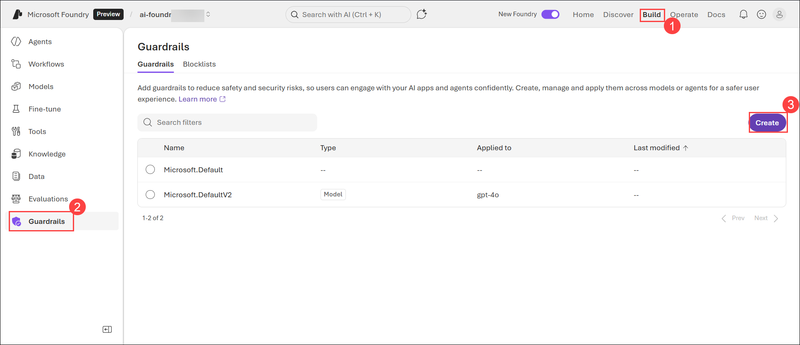

1. Select **Add models** 

     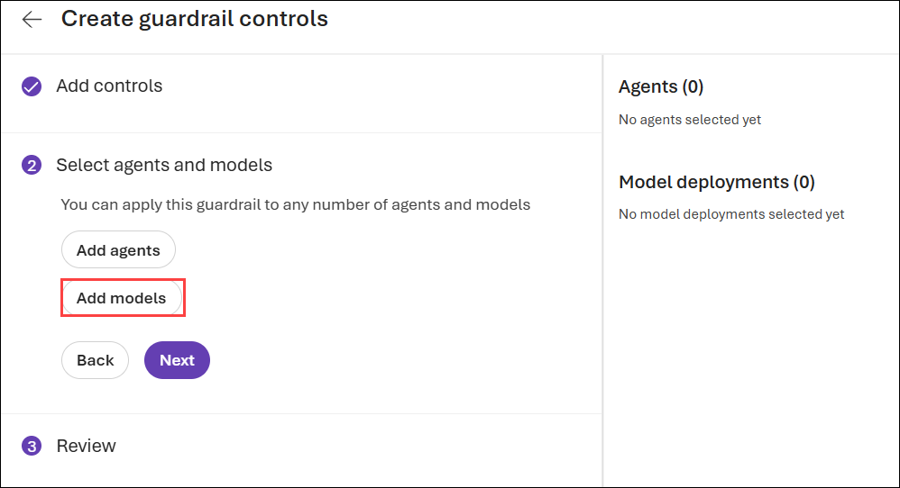

1. On the **Model deployment** page, select **both deployments (1)** and click **Next (2)** to continue.

    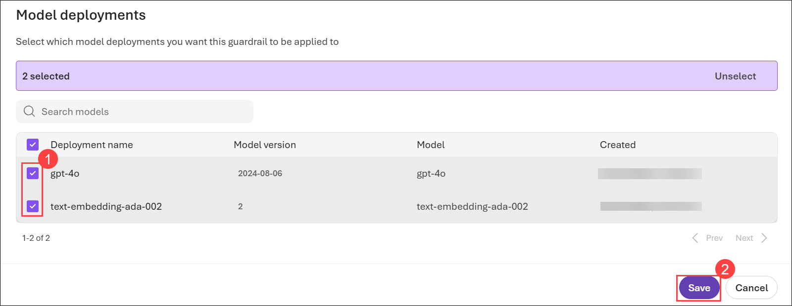

1. Click on **Next** once both models are selected.

    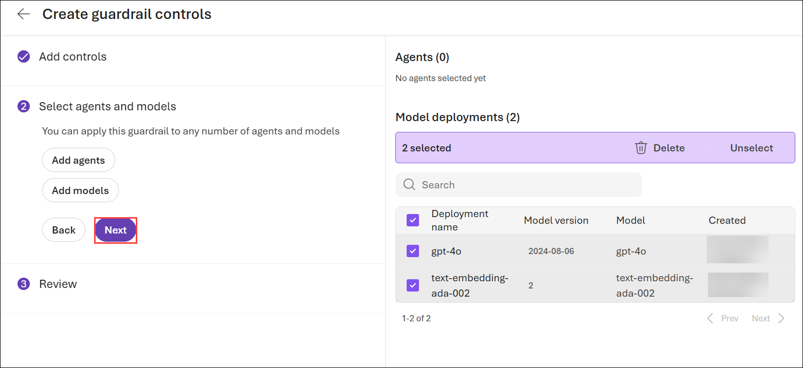

1. Select the **Gaurdrail name** as **AggressiveContentFilter (1)** and select required controls from right pane and click on **Submit (2)**.

    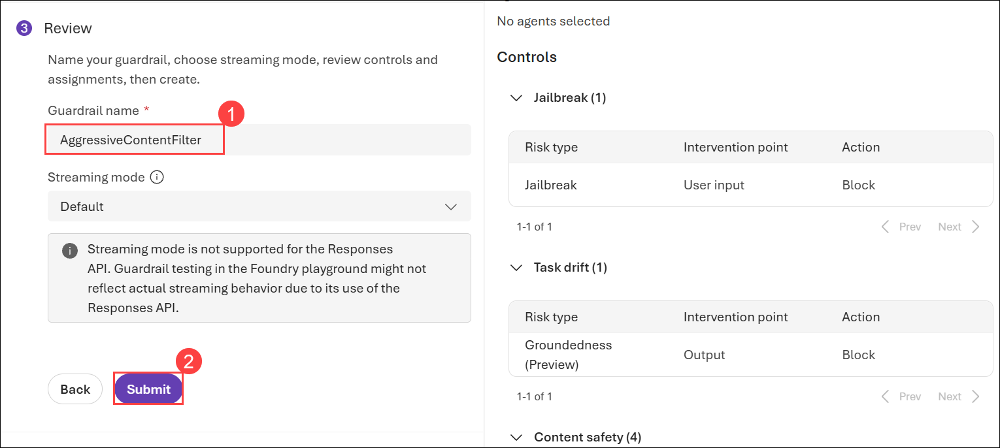

## Task 2: Filter specific words or patterns

In this task, you will explore different flow types in Microsoft Foundry by filtering specific words or patterns to refine search results and enhance data relevance.

1. From the left-pane select **Gaurdrails (1)**, select **Blocklists (2)** and click on **Create blocklist (3)**.

    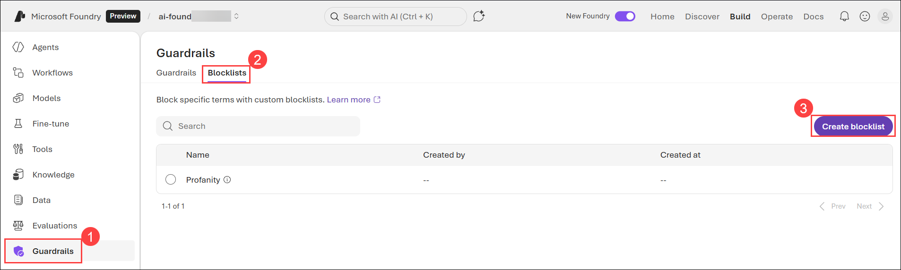
    
1. On the **Create a blocklist** blade, specify the following configuration options and click on **Create (3)**.

    - **Name**: Enter **CustomBlocklist<inject key="Deployment ID" enableCopy="false"></inject> (1)**

    - **Description**: `This is a custom blocklist.` **(2)**

      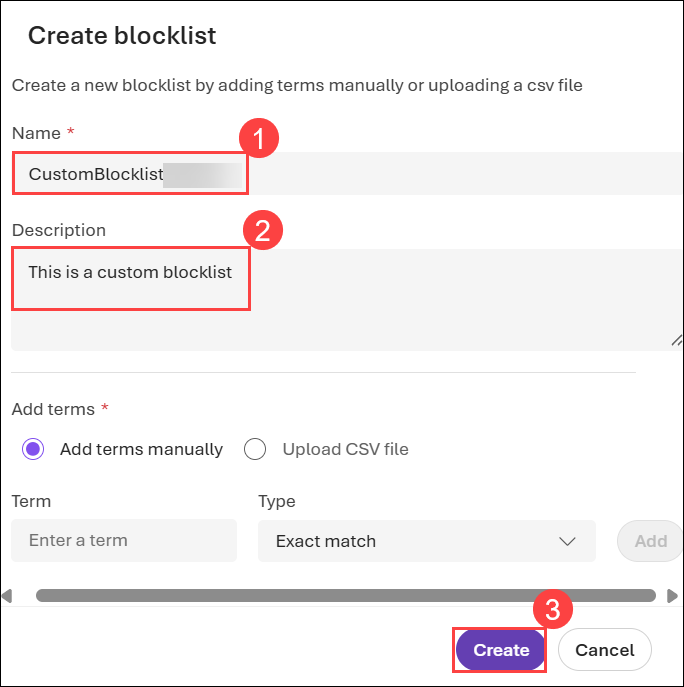

1. Click on **CustomBlocklist<inject key="Deployment ID" enableCopy="false"></inject>** created and click on **Edit (2)**.  

    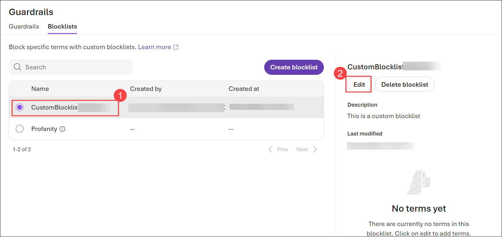

1. Fromt the top menu bar, click on **Add term**.

    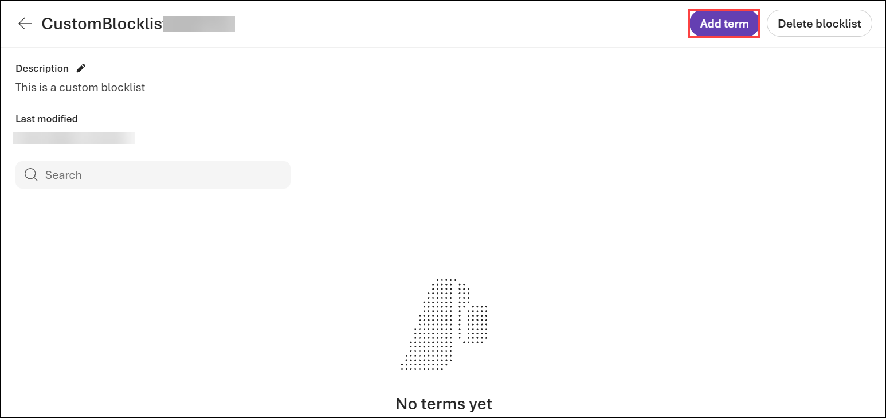

1. Select **Add terms manually (1)** as the term, enter the term **credentials (2)** select the type **Exact Match (3)** or **Regex** as required, and click **Add (4)** to save it.

    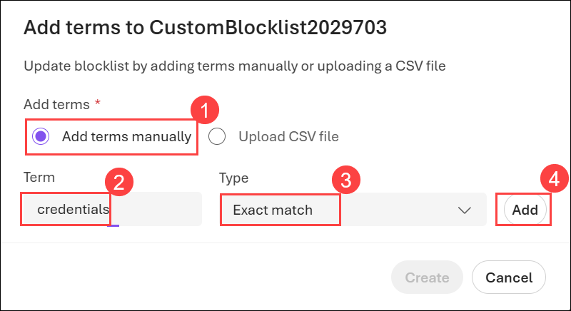

1. Click on **+ Add new term** again.   

    

1. Repeat the step for the following and select the type as required (**Exact Match** or **Regex**) once all are added **(1)** and click on **Create (2)**:-

    - password
    - exploit
    - hack
    - keylogger
    - phishing
    - SSN
    - credit card
    - bank account
    - CVV
    - casino
    - poker
    - betting

      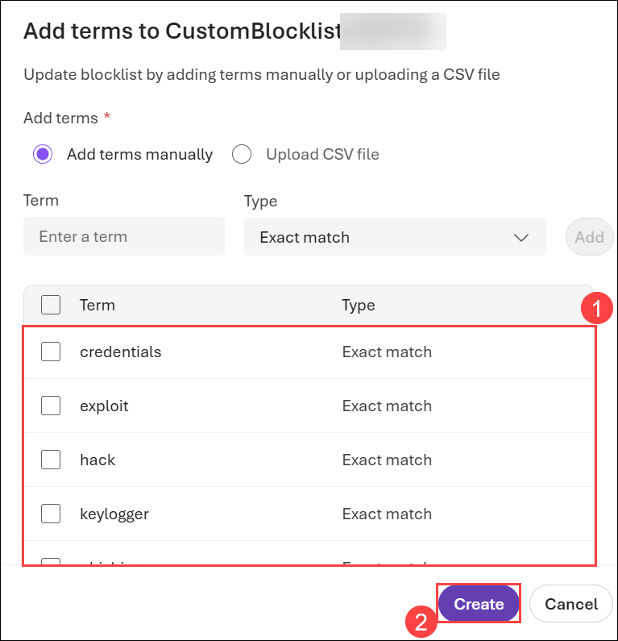

## Summary

In this exercise, you have completed the following:

- Adjusted filter settings.

- Filtered specific words or patterns.

### You have successfully completed this exercise. Kindly click **Next >>** to proceed further

